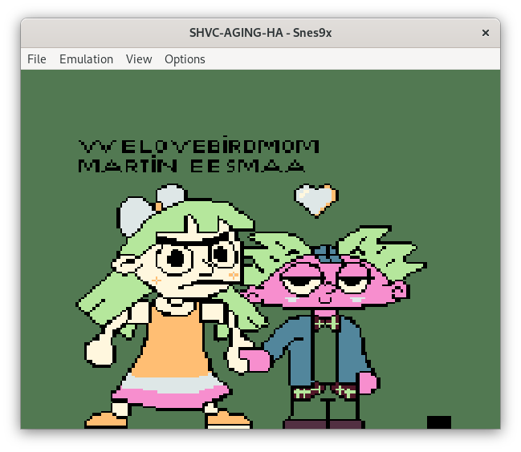

# Super Famicom Aging Program (decompiled by Martin Eesmaa)

Please note that this is for archival purposes, educational and other purposes of decompiled SHVC-AGING SNES ROM.

It can emulate ROM decompiled, including original to the SNES emulators, others & real hardwares.

## Sample screenshot



**Credit: welovebirdmom (original, wplace) & Martin Eesmaa (wplace, SNES) [2025]**

## Requirement

You need MAKE from GCC and also [wla-dx](https://github.com/vhelin/wla-dx) 10.0 and later to compile the decompiled assembly files.

1. Compile it using `make`

And the result ROM file game is game.smc.

Original MD5 sum of SHVC-AGING V1.00 SNES LoRom file: `eaf9f580b4798470f26786d9340922ab`

Decompiled MD5 sum of SHVC-AGING V1.00 SNES LoRom file: `59029b262fde1c5d83a7f919ff9b442c`

If you want to recompile again, first clean and then remake it again:

```
make clean
make
```

## Pre-decompile the game

Precopy of original SNES ROM of Aging Test Cartridge is available on OBIN folder.

Taken from Internet Archive: https://archive.org/details/super-famicom-aging-program-ver-1-00

Used to decompile using [snes2asm](https://github.com/nathancassano/snes2asm) python wrapper.

Command:

```
snes2asm -nl -o SHVC SHVC-AGING.scf
```

- Martin Eesmaa
